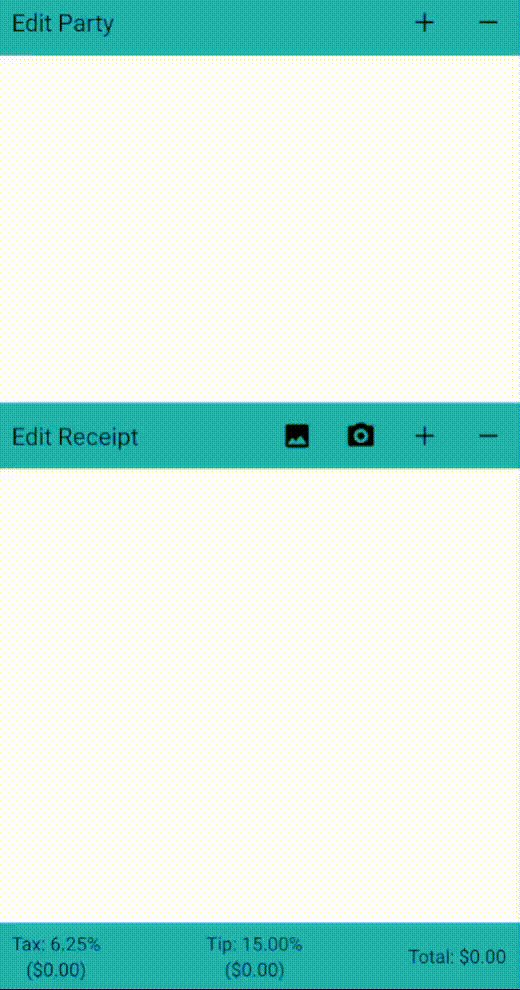
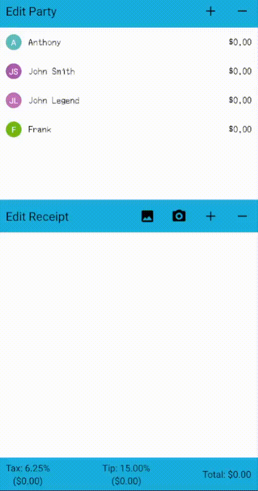
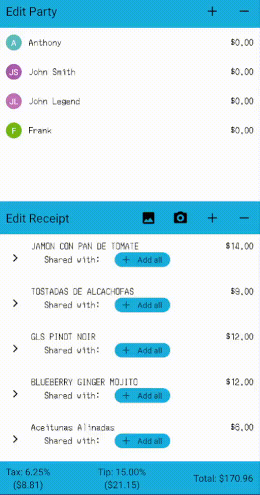

# Shareceipt
Shareceipt is a simple Android app helps you scan a receipt and fairly split it within a group.
It supports splitting items among multiple people (maybe 3 people shared an appetizer), as well as the annoying details of taxes and tips.
Just assign each person to the items they had, and the app does the rest!

## How to use

#### Step 1: Add party members
You'll first want to add all the people in your group. 
To do so, just press the + button to add a person, then click on their name to edit it.

In case you've somehow added too many people, just press the - button to remove people from the list.



#### Step 2: Scan and edit your receipt
Now you want to actually scan the receipt that you'll be splitting up, either by selecting an image that you've already taken or taking an image straight from the app.

Once the app has scanned your image, there may be some mistakes that you'll have to fix, either an incorrect price or a missing item.
Both can be easily fixed by tapping on an item's price or pressing the + button to add another item.
Once again, if you need to remove an item from the list, just press the - button to do so.



#### Step 3: Edit the tip and tax
Now that you have your receipt scanned, you can edit the tip and tax. 
You can give either the percentage or the exact amount, depending on what you're given.



#### Step 4: Assign people to their items 
Finally, you just need to assign each person to the items that they'll be paying for.
For items that everyone shared, just press the "Add all" button to split it amongst everyone.
For other items, first press on the person to select them, and they press on an item to assign them to it. 
Repeat this for every item on the receipt. 


#### Step 5: You're done!
Now, just read the amount each person needs to pay from beside their name, split fairly for everyone!

## Building
As this project does have native Android code, you do need Android Studio installed to build and run the app.
Luckily, Expo makes it a lot less painful to do so; once you have the dependencies installed with `npm install`, just run `npm run android` (or `expo run:android`) to build and start up the app in your connected Android device/emulator.

## Technologies Used
- [React Native](https://reactnative.dev/)
- [Expo](https://expo.dev/)
- [React Native Paper](https://reactnativepaper.com/)
- [Tesseract4Android](https://github.com/adaptech-cz/Tesseract4Android)

## License
```
Copyright 2022 Anthony Cui

Licensed under the Apache License, Version 2.0 (the "License");
you may not use this file except in compliance with the License.
You may obtain a copy of the License at

    http://www.apache.org/licenses/LICENSE-2.0

Unless required by applicable law or agreed to in writing, software
distributed under the License is distributed on an "AS IS" BASIS,
WITHOUT WARRANTIES OR CONDITIONS OF ANY KIND, either express or implied.
See the License for the specific language governing permissions and
limitations under the License.
 ```