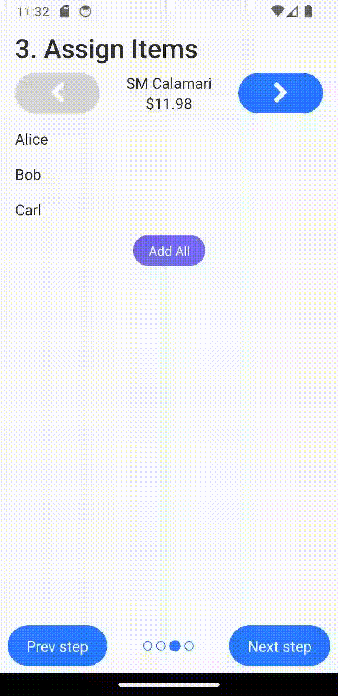
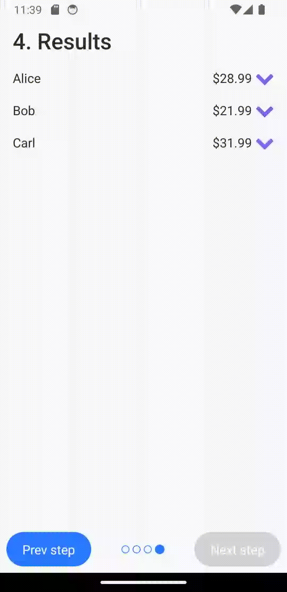

# Shareceipt
Shareceipt is a simple Android app helps you scan a receipt and fairly split it within a group.
It supports splitting items among multiple people (maybe 3 people shared an appetizer), as well as the annoying details of taxes and tips.
Just assign each person to the items they had, and the app does the rest!

## How to use

#### Step 1: Add party members

You'll first want to add all the people in your group via the "Add Member" button at the top.
Each person can be further renamed or removed by pressing on the three dots to the right.

If this is a party that you are frequently with, you can easily save the list of people at the top left!
Saved parties can then be loaded by pressing the people icon.


#### Step 2: Scan and edit your receipt

Now you want to actually scan the receipt that you'll be splitting up, either by selecting an image or manually adding
each item.

Once the app has scanned your image, there may be some mistakes that you'll have to fix, either an incorrect price or a missing item.
Once again, you can easily edit or remove an item by pressing the three dots to the right.


#### Step 3: Edit the tip and tax
Now that you have your receipt scanned, you can edit the tip and tax. 
You can give either the percentage or the exact amount, depending on what you're given.
At this point, you can double check that the total amount is correct, and make any further edits if needed.


#### Step 4: Assign people to their items 
Finally, you just need to assign each person to the items that they'll be paying for.
For items that everyone shared, just press the "Add all" button to split it amongst everyone.
For other items, simply select the names of the people who had it!
Repeat this for every item on the receipt. 



#### Step 5: You're done!
Now, just read the amount each person needs to pay from beside their name, split fairly for everyone!
If you want a breakdown of what exactly someone is paying for, just press their name to see the details.



## Building
As this project uses native Android code to perform the OCR, you do need the Android SDK installed to build and run the app.
Luckily, Expo makes it a lot less painful to do so; 
just run these commands to build and start the app in your connected Android device/emulator.
```
npm run install
npx expo prebuild 
npx expo run:android
```

## Technologies Used
- [React Native](https://reactnative.dev/)
- [Expo](https://expo.dev/)
- [RNUI](https://wix.github.io/react-native-ui-lib/)
- [Tesseract4Android](https://github.com/adaptech-cz/Tesseract4Android)

## License
```
Copyright 2022 Anthony Cui

Licensed under the Apache License, Version 2.0 (the "License");
you may not use this file except in compliance with the License.
You may obtain a copy of the License at

    http://www.apache.org/licenses/LICENSE-2.0

Unless required by applicable law or agreed to in writing, software
distributed under the License is distributed on an "AS IS" BASIS,
WITHOUT WARRANTIES OR CONDITIONS OF ANY KIND, either express or implied.
See the License for the specific language governing permissions and
limitations under the License.
 ```